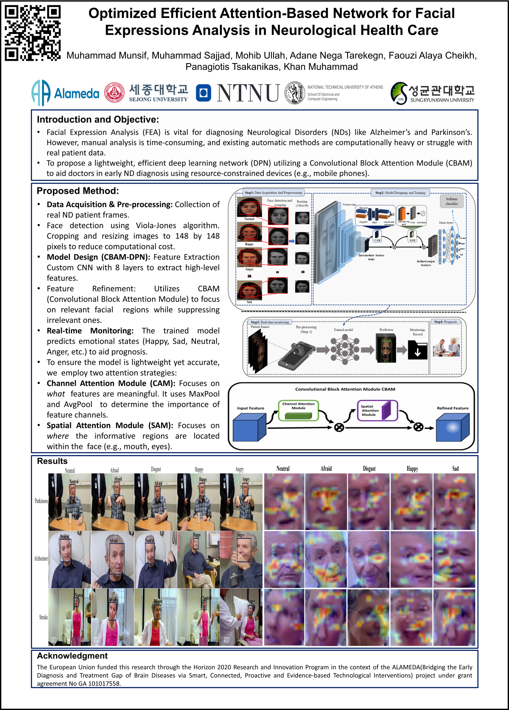

# Optimized Efficient Attention-Based Network for Facial Expressions Analysis in Neurological Health Care

<p align="center">
  <a href="https://www.elsevier.com/locate/compbiomed"></a>
  <a href="https://doi.org/10.1016/j.compbiomed.2024.108822"></a>
  <a href="https://doi.org/10.1016/j.compbiomed.2024.108822"></a>
  
</p>

---

## 📋 Table of Contents

- [Overview](#-overview)
- [Key Highlights](#-key-highlights)
- [Methodology](#️-methodology)
- [Experimental Results](#-experimental-results)
- [Conference Poster](#-conference-poster)
- [Data Access](#-data-access)
- [Code Availability](#-code-availability)
- [Citation](#-citation)
- [Contact](#-contact)
- [Acknowledgments](#-acknowledgments)

---

## 📌 Overview

Facial Expression Analysis (FEA) plays a vital role in diagnosing and treating early-stage neurological disorders (NDs) like Alzheimer's and Parkinson's. However, manual analysis is hindered by expertise requirements, while existing automatic methods struggle with high computational costs and a lack of real patient data.

To address these challenges, this repository hosts the implementation of a **novel, efficient, lightweight Convolutional Block Attention Module (CBAM) based Deep Learning Network (DLN)**. This framework is designed to aid doctors in diagnosing ND patients by extracting relevant facial features with high efficiency, making it suitable for resource-constrained mobile healthcare devices.

---

## 🔑 Key Highlights

| Feature | Description |
|---------|-------------|
| 🪶 **Lightweight Architecture** | Optimized for smart health applications, occupying only **3 MB** with 0.9 million parameters, deployable on smartphones and Raspberry Pi |
| 🎯 **High Performance** | Achieved **73.2% accuracy**, **73.4% precision**, and **73.5% recall** on real patient data, outperforming state-of-the-art models |
| 🧠 **Attention Mechanism** | Custom CNN with **CBAM** to refine features via channel and spatial attention, focusing on relevant facial regions |
| ✅ **Real-World Validation** | Validated on real ND patients (Parkinson's, Alzheimer's, Stroke) and standard datasets (KDEF, RAVDESS) |

---

## 🏗️ Methodology

The proposed framework operates in four stages:

### 1. Data Acquisition & Pre-processing
- Utilizes the **Viola-Jones algorithm** for face detection
- Cropping and resizing images to **148 × 148** pixels to reduce computational cost

### 2. Feature Extraction
- A custom **6-layer CNN** extracts high-level features from facial images

### 3. Feature Refinement (CBAM)
- **Channel Attention Module (CAM):** Focuses on *"what"* is meaningful in the image
- **Spatial Attention Module (SAM):** Focuses on *"where"* the informative part is located

### 4. Classification
- A fully connected layer with **Softmax** classifies the emotional state:
  - Happy, Sad, Neutral, Angry, Disgust

---

## 📈 Experimental Results

We conducted extensive ablation studies and comparisons with state-of-the-art (SOTA) models. Our CBAM-based model demonstrated superior diagnostic performance, particularly for Parkinson's and Alzheimer's diseases.

### Performance Comparison on Real Patient Data

| Model | Attention | Accuracy (%) | Parameters (M) | Inference Time (s) |
|:------|:----------|:-------------|:---------------|:-------------------|
| ResNet-101 | CBAM | 42.0 | 43.9 | - |
| MobileNet | CBAM | 44.5 | 4.1 | - |
| **Proposed (Ours)** | **CBAM** | **73.2** | **0.9** | **0.7** |

> 📊 Qualitative analysis using attention maps confirms the model focuses on relevant facial regions (eyes, mouth) even in patients with reduced facial expressivity due to NDs.

---

## 📊 Conference Poster

<p align="center">
  
</p>

---

## 💾 Data Access

The Neurological FER evaluation dataset is provided as a `FER_NDs_Test_Data.rar` file in this repository.

> ⚠️ **Note:** This dataset includes real patient data collected for cross-validation purposes.

For further questions regarding data access, please contact Munsif at [munsif3797@gmail.com](mailto:munsif3797@gmail.com).

---

## 💻 Code Availability

The complete source code for the proposed framework will be made available shortly. Stay tuned for updates!

---

## 📚 Citation

If you use this work in your research, please cite our paper:

```bibtex
@article{Munsif2024Optimized,
  title     = {Optimized efficient attention-based network for facial expressions analysis in neurological health care},
  author    = {Munsif, Muhammad and Sajjad, Muhammad and Ullah, Mohib and Tarekegn, Adane Nega and Cheikh, Faouzi Alaya and Tsakanikas, Panagiotis and Muhammad, Khan},
  journal   = {Computers in Biology and Medicine},
  pages     = {108822},
  year      = {2024},
  publisher = {Elsevier},
  doi       = {10.1016/j.compbiomed.2024.108822}
}
```

---

## 📧 Contact

For any questions or collaborations, please reach out to:

**Muhammad Munsif**  
📧 Email: [munsif3797@gmail.com](mailto:munsif3797@gmail.com)

---

## 🙏 Acknowledgments

We would like to thank all the contributors and collaborators who made this research possible. Special thanks to the medical institutions that provided access to real patient data for validation purposes.

---

<p align="center">
  <b>⭐ If you find this work useful, please consider giving it a star!</b>
</p>
